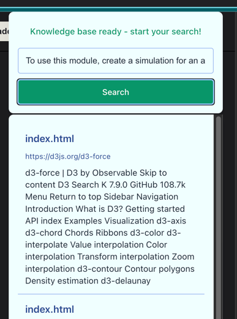

# Text Search Chrome Browser Extension

Support building website knowledge and full text search.

## Features

- scrape current website data
- build index
- full text search
- It uses web socket to check if current website's knowledge has been already built and if it's built, you can start search.

## Prerequisites

- Google Chrome browser

## Project Structure

```
extension/
├── manifest.json
├── style.css
├── content.js
```

## Local Development Setup

1. **Clone the repository**
   ```bash
   git clone <repository-url>
   cd extension
   ```

2**Load the extension in Chrome**
    - Open Chrome and navigate to `chrome://extensions/`
    - Enable "Developer mode" in the top right corner
    - Click "Load unpacked"
    - Select the `extension` directory from your project

## Testing

### Manual Testing
1. After loading the extension, you should see its icon in the Chrome toolbar
2. Click the extension icon to open the popup
3. Navigate to different websites to test content script functionality




## Development Tips

### Hot Reloading
- After making changes to your code:
    1. Go to `chrome://extensions/`
    2. Click the refresh icon on your extension card
    3. Reload any tabs where the extension is active


### Common Issues

1. **Extension not updating:**
    - Make sure to reload the extension after code changes
    - Clear browser cache if necessary

2. **Content script not working:**
    - Verify matches patterns in manifest.json
    - Check console for errors
    - Ensure permissions are correctly set

3. **Storage issues:**
    - Verify storage permission in manifest.json
    - Check quota limits if storing large amounts of data

## Building for Production

1. **Prepare for distribution:**
   ```bash
   npm run build
   ```

2. **The build process will:**
    - Minify JavaScript files
    - Optimize images
    - Create a ZIP file ready for Chrome Web Store submission

## Contributing

1. Fork the repository
2. Create a feature branch
3. Commit your changes
4. Push to the branch
5. Create a Pull Request

## privacy policy
https://sites.google.com/view/searchtext/privacy-policy

## License
This project is licensed under the MIT License - see the LICENSE file for details.